# FelipedelosH

Esta es mi prueba tecnica para: 
'Integraciones y desarrollos tecnológicos SAS'

Nota: el enunciado de los problemas esta en: Docs/Prueba de conocimiento en programación.docx

Advertencia: recuerde antes ejecutar el script para mysql: Docs/script.sql
Advertencia: recuerde descoprimir ejercicios.zip en la carpeta C:\wamp64\www

### WAMPSERVER (/phpmyadmin>root:noPass) + MySQL
### VS code
### PHP
### HTML
### JavaScript

# Primer componente: Básico

## Ejercicio 01

Está escrito en PHP, por favor instalar wampserver y pasale el numero por url 
http://localhost/ejercicio01/?number=31
 
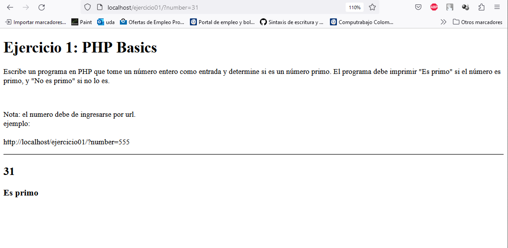

## Ejercicio 02

Está escrito en PHP y llama a un archivo .js la respuesta del ejercicio es:
 
sumOnlyPairsInVector(array)
 

## Ejercicio 03

Está escrito en PHP 

SQL para crear tabla usuarios:

CREATE TABLE usuarios(
 id int unsigned not null primary key auto_increment,
 nombre varchar(50),
 correo varchar(50),
 timeStampCreate varchar(50),
 timeStampUpdate varchar(50)
);
 
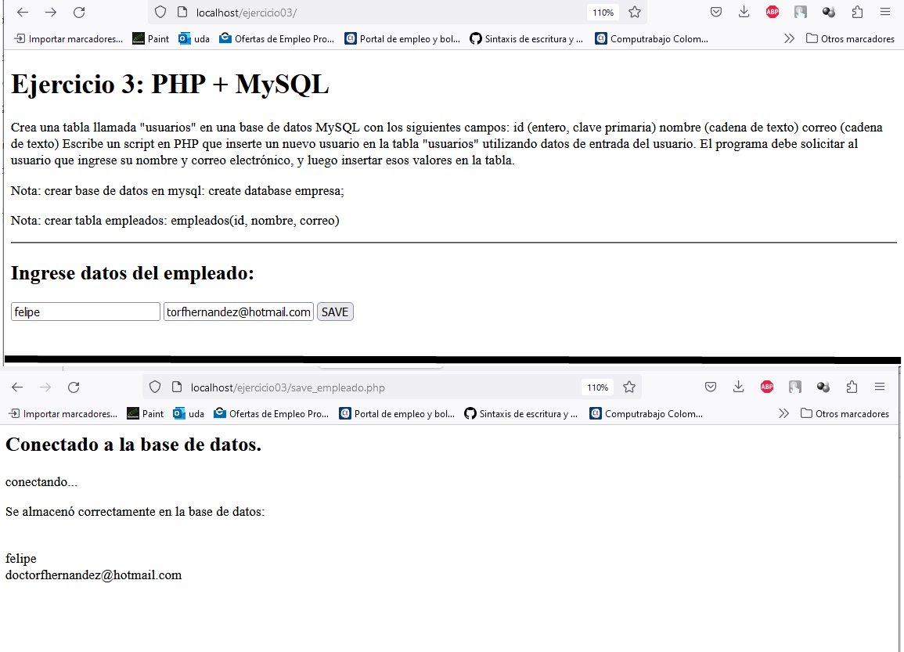

## Ejercicio 04

Esta escrito en PHP y llama a un archivo .js la respuesta del ejercicio es:
 
 changeColorBG()
 
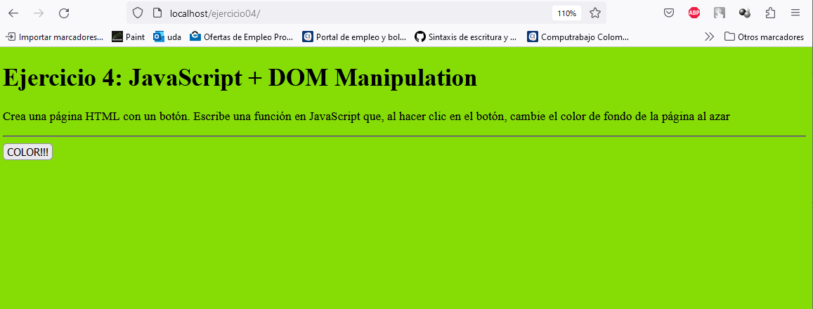

## Ejercicio 05

Esta escrito en PHP
 
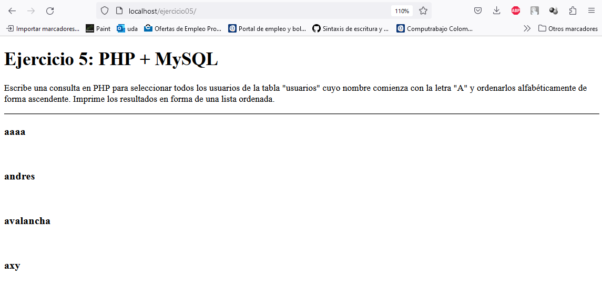

# Segundo componente: Orientado a objetos

## Ejercicio 11

El codigo en concreto se encuentra en el archivo: employed.php
 
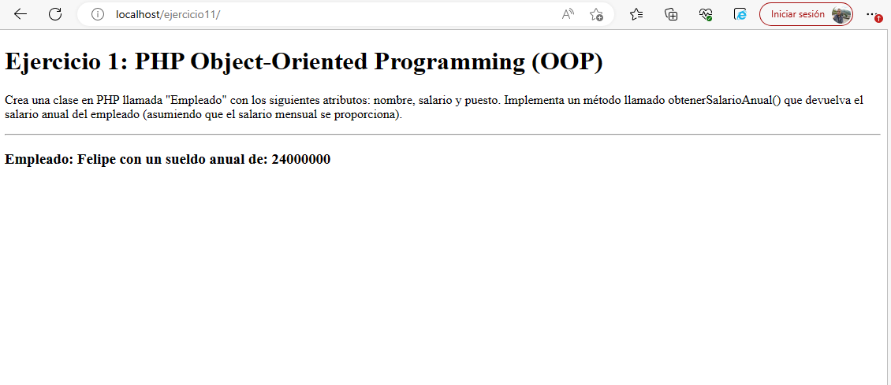

## Ejercicio 12

El codigo en concreto se encuentra en el archivo: javascript.js
 
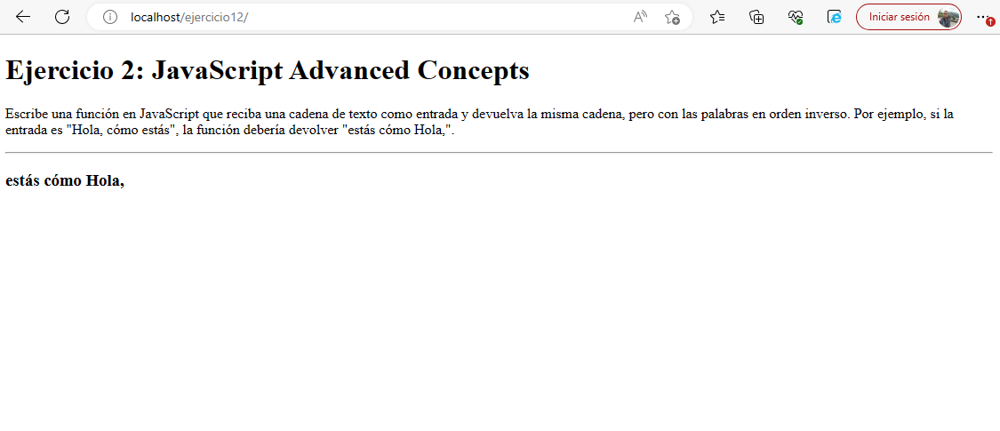

## Ejercicio 13
El codigo en concreto se encuentra en el archivo: sales.controller.php en la función: getMostProductSale()
 
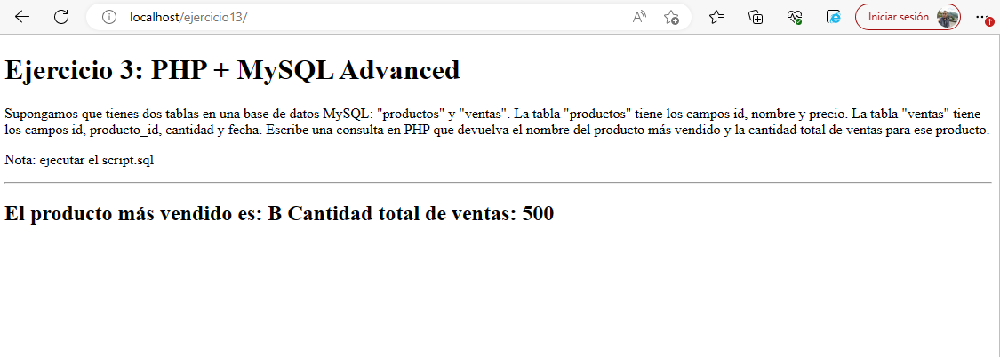

## Ejercicio 14
El codigo en concreto se encuentra en el archivo: js\javascript.js getWeatherInCountry()
 
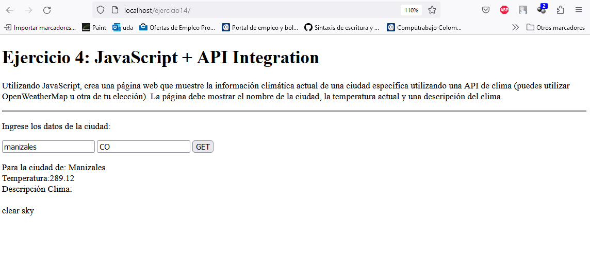

## Ejercicio 15
El codigo en concreto se encuentra en el archivo: passwordValidator.php validatePassword()

Nota: "Un programador tenía un problema, y decidió usar expresiones regulares para solucionarlo. Ahora tiene dos problemas"
 
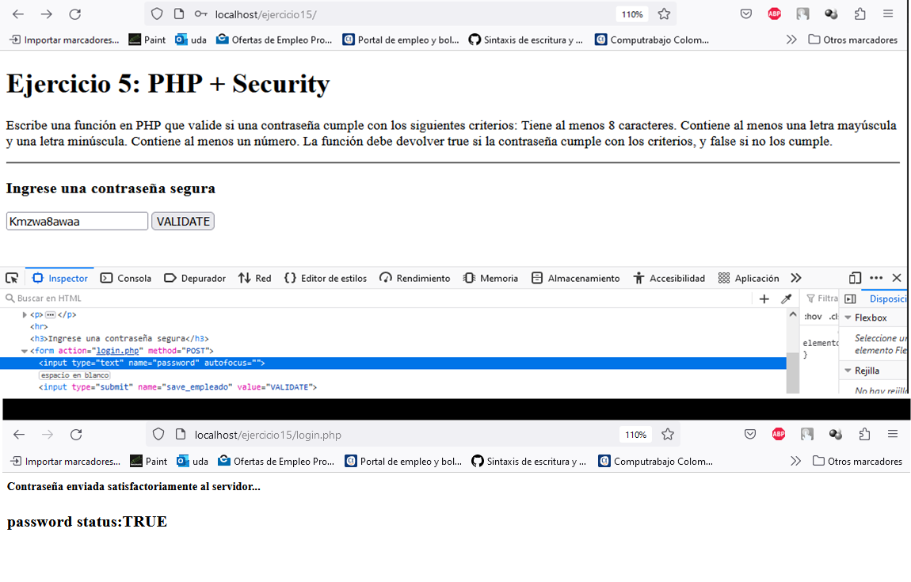

## Ejercicio 21
Se utilizó MVC
 
 
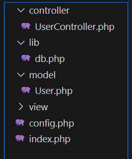
 

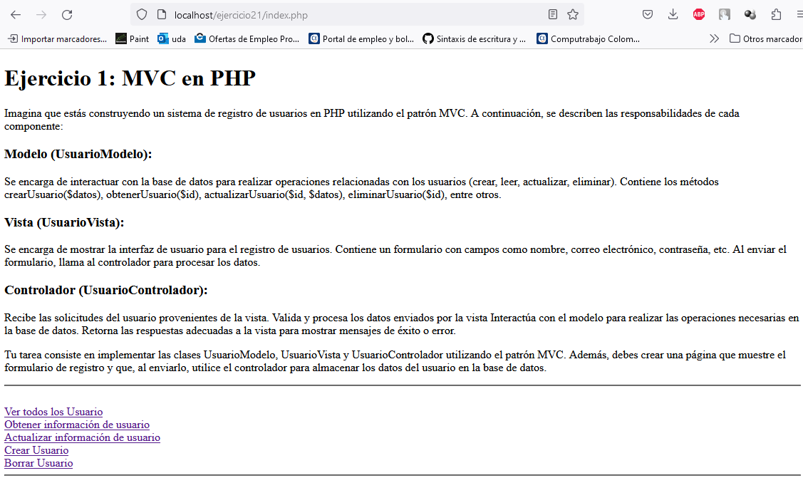

